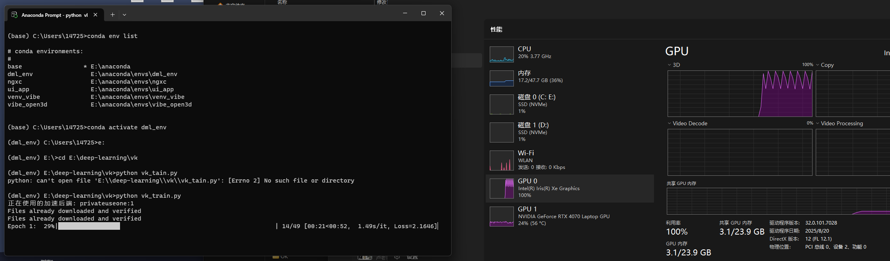
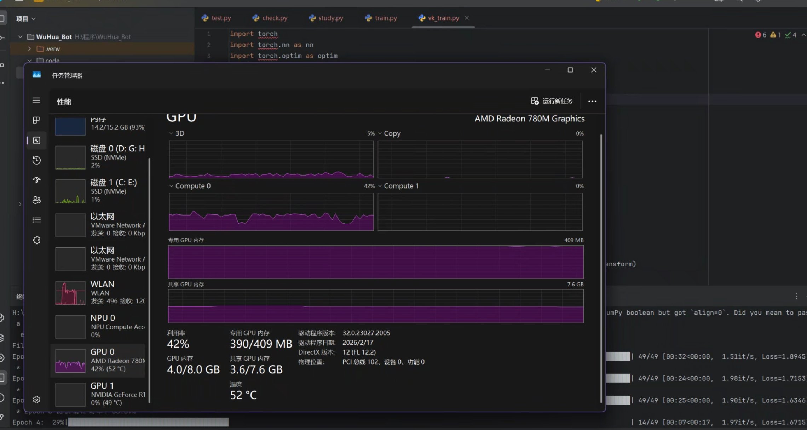
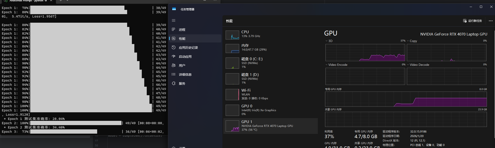
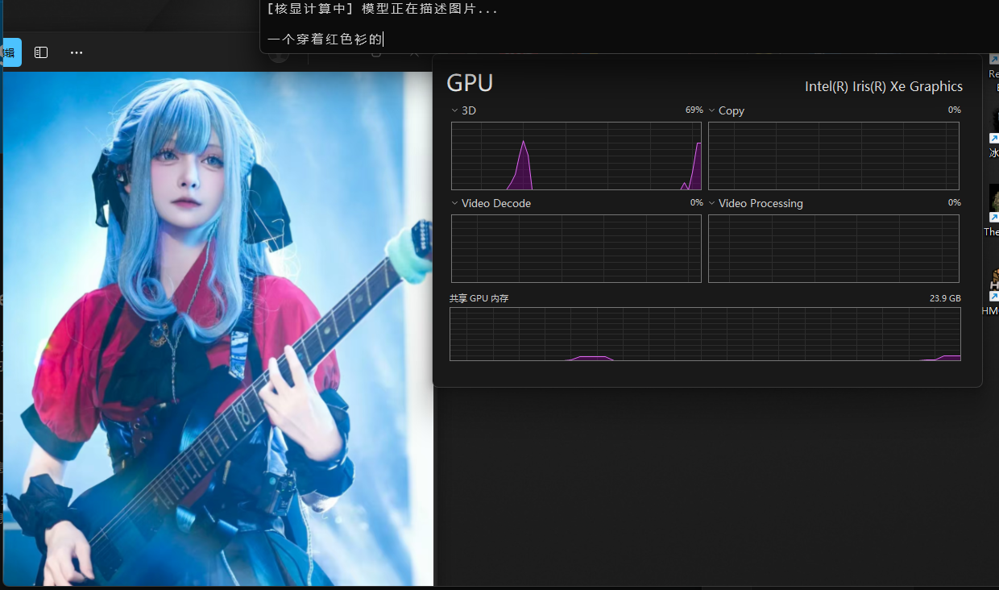
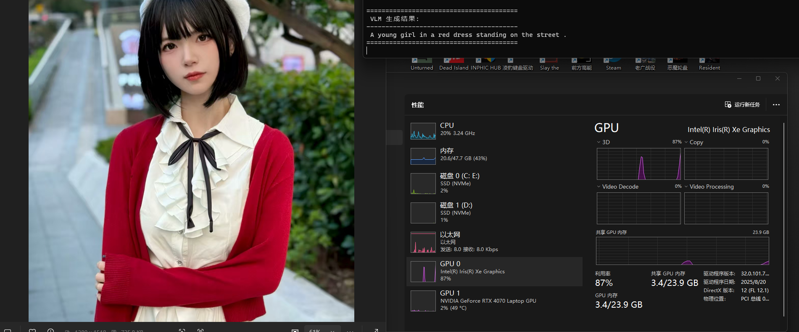
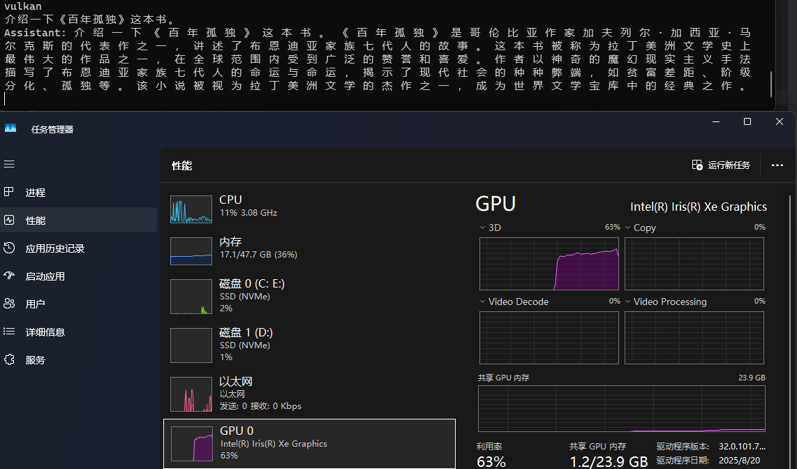

# no_cuda
## 让大模型推理不在cuda一家独大

### 前言
在逛微软的技术文档时，我发现了微软通过 DirectML 启用 PyTorch 的文档，于是尝试下载拓展：
`pip install torch-directml`

安装后，它与正常的 PyTorch 使用方式几乎一致，只是多了 `dml = torch_directml.device()`，采用和 CUDA 一样的调用方式，直接 `.to(dml)` 即可。

**备注：** 设备的编号是按算力高低排序，所以一般对于正常电脑，设备标号 1 的才是核显。

### 实践效果
通过类似的方法调用核显进行加速，以最经典的 CNN 分类 CIFAR-10 为例，我们可以看到长期吃灰的核显跑起来了：

只要是 DX12 的设备都能跑起来，不管你是 A 卡、I 卡还是 N 卡：

（甚至上一代最强核显能跑出更快的速度，AMD yes）。当然 N 卡由于规模摆在那，速度还是无法比拟的：

### 遇到的问题与解决方案
目前看起来一切没有问题，但是当使用这个拓展重构我先前的项目时，出现了一些问题：

由于 `transformers` 库的 `model.generate()` 是一个高度封装的函数，它在内部调用了复杂的采样算法。同时 DML 不是像 CUDA 那样原生支持所有的 PyTorch 算子功能（期待以后能成 Vulkan 一样），所以我们只能手动编写 `generate` 循环。

然后经过多次试错发现，DML 由于是基于 DX12 而不是 CUDA 那种软硬件协同的，在 Xe 核显上会出现莫名其妙的 `nan` 值，所以只能使用 `torch.nan_to_num` 处理，具体操作可以详见代码。

### 成果展示
修复好了问题就能正常调用我之前自己构造训练的 LLM 和 VLM 了，并且他们都能跑在 Xe 核显上。中英文的 VLM 都能跑起来：

并且 LLM 也可以：

并且由于是基于 PyTorch 的，我们无需改变任何权重。

### 未来展望
对于一些现代化的 VLM 存在算子缺失的问题，例如 Qwen2.5-VL 的三维卷积缺乏对应算子，目前正在尝试如何用最基础的算子实现三维卷积的功能。

敬请期待！
